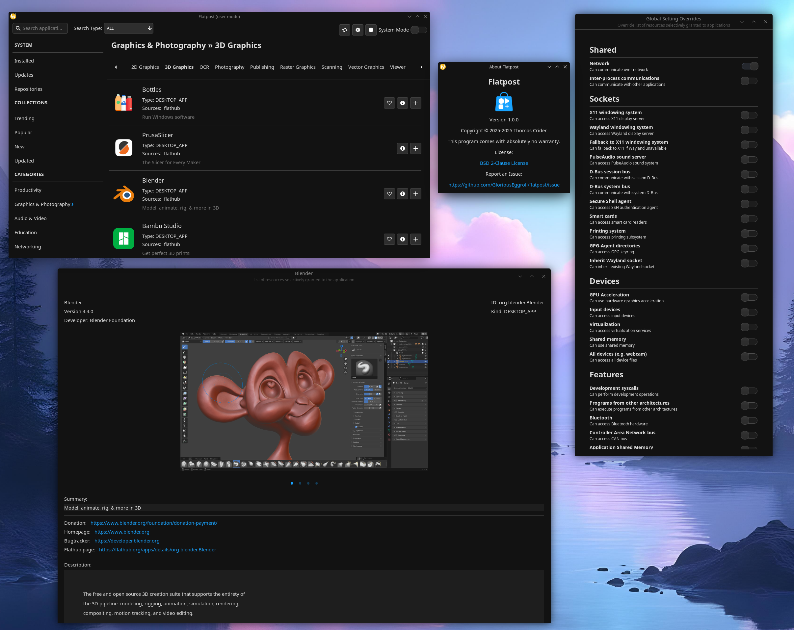
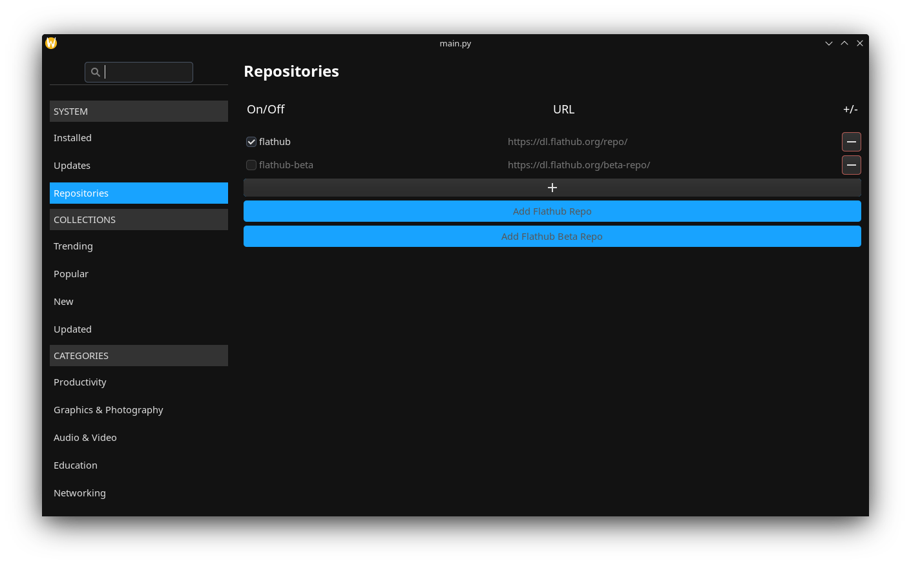

This is very much currently WIP.

DONE:
- Appstream metadata loading and search
- Appstream metadata refresh
- Collections metadata loading and search
- Collections metadata refresh
- Repository management functions
- Repository management GUI
- Installed package query functions
- Available updates package query functions
- GUI layout of system, collections, and categories entries.
- GUI layout of application list
- GUI layout of buttons
- GUI layout of search
- Donate/Support button and function.
- Install button functions
- Remove button functions
- System mode backend
- Search function

TODO:
- Update button functions
- Update management GUI
- System mode toggle
- Refresh metadata button
- List Applications only checkbox
- Package information page/section.
- Implement subcategories
- General GUI layout/theming improvements
- Sort runtimes from Desktop Apps
